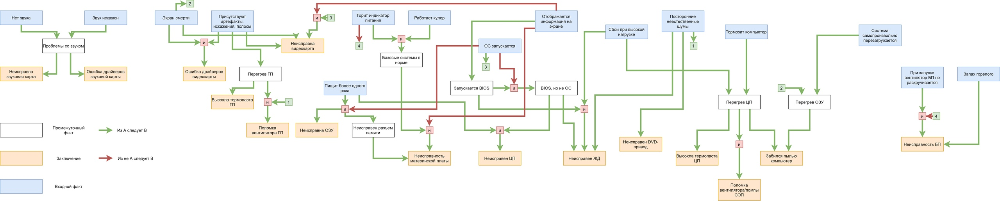

# Отчет по лабораторной работе
## по курсу "Искусственый интеллект"

### Студенты: 

| ФИО       | Роль в проекте                     | Оценка       |
|-----------|------------------------------------|--------------|
| Иванов Н.А. | Разработка модели знаний |          |
| Куликов А.В.| Реализация ЭС на Прологе |       |
| Сливин М.В. | Разработка модели знаний |      |
| Чакирян А.А | Составление базы знаний, тестирование |          |

## Результат проверки

| Преподаватель     | Дата         |  Оценка       |
|-------------------|--------------|---------------|
| Сошников Д.В. |     27.05.2020         |        5       |

## Тема работы

Создание экспертной системы для диагностики неполадок компьютера.

Во время создания системы использовались знания экспертов в области ремонта компьютеров, а так же небольшой личный опыт авторов проекта.

Мы позиционируем данную экспертную систему как прототип программы для базовой диагностики компьютера. От пользователя требуется ввести факты, которые достаточно трудно не заметить при работе за компьютером.

## Концептуализация предметной области

Во время концептуализации были выделены следующие понятия: компьютерные комплектующие, неисправность, видимые факторы.

Тип онтологии — сеть.

Т.к. архитектура компьютера вряд ли сильно изменится в ближайшие годы, все знания предметной области можно считать статическими и актуальными.

В случае же необходимости в любой момент можно добавить, изменить или удалить недействительные правила, не отвечающие текущим правилам взаимодействия между компонентами компьютера.

Приведите графические иллюстрации:


## Принцип реализации системы
В качестве механизма вывода был выбран прямой логический вывод.
Обычно прямая цепочка рассуждений применяется в задачах, где на основании имеющихся фактов необходимо определить класс объекта или явления, выдать рекомендацию, определить диагноз. А это как раз наш случай. К тому же обратный поиск достаточно плохо ложился на идею доспрашивания пользователя. Доспрашиваться начинали вещи, совсем не имеющие отношения к исходно введенным фактам. 
 
Система реализована на языке Prolog в реализации SWI-Prolog version 7.6.4. Язык Prolog идеально подходит для реализации экспертных систем т.к. в нем "из коробки" есть механизм логического вывода, который достаточно легко адаптировать под наши нужды.

## Механизм вывода

В проекте используется механизм прямого логического вывода. 

Механизм вывода довольно прост. Получив список всех правил вывода, мы по очереди пытаемся применить каждое из них. В случае успеха, в базу знаний заносится очередной факт, благодаря которому в последующих итерациях становятся применимы новые правила вывода. Далее обход всех правил начинается сначала. На каком-то этапе мы не сможем найти применимого правила, это означает что, процесс логического вывода закончен. Если входных фактов было достаточно, то в базе знаний будет лежать несколько выведенных исходов, которые и следует вывести пользователю.

```prolog
% предикат пробует применить правило
try_rule(_ значит Y):-
    fact_in_base(Y), !, fail. % если правило уже было применено, и из него получен результат, то больше не используем его

try_rule(X значит Y):-
    check(X), % если требования правила истинны
    asserta(fact(Y, t)). % добавляем факт в базу знаний

% предикат для применения всех правил, пока находится подходящее к применению правило
try_all_rules([], _):-!. % не нашлось подходящего правила
try_all_rules([H|_], R):-
    try_rule(H), !, % если правило подошло
    try_all_rules(R, R). % начинаем опять с первого правила

try_all_rules([_|T], R):- % если правило не подошло
    try_all_rules(T, R). % идем к следующему

% прямой логический вывод
direct_search:-
    rules(R),
    try_all_rules(R, R).
```

## Извлечение знаний и база знаний

Для составления базы знаний мы использовали популярные сайты по самостоятельной диагностике компьютера, гайды на Youtube и тому подобные материалы. Была представлена база фактов и правил для их вывода, показанная на рисунке выше.

Для больше простоты работы с правилами вывода и фактами были введены дополнительные операторы и, или, не, значит.

Входные факты в базе знаний должны быть отмечены предикатом input:

```prolog
input("звук искажен").
```

Возможные факты-исходы помечены предикатом result:

```prolog
result("Неисправен ЦП").
```

Правило вывода может быть представлено следующим образом:

```prolog
"пищит более одного раза" и не "запускается ОС" значит "Неисправна ОЗУ".
```

Непосредственно факты время работы отмечаются предикатом fact.

```prolog
fact("ПЕРЕГРЕВ ЦП", t).
fact("Неисправность БП", f).
```

## Протокол работы системы

```
$ swipl -q main.pl
1. нет звука?
2. звук искажен?
3. вылетает экран смерти?
4. присутствуют артефакты, искажения, полосы?
5. пищит более одного раза?
6. горит индикатор питания?
7. работает кулер?
8. запускается ОС?
9. отображается информация на экране?
10. присутствуют сбои при высокой нагрузке?
11. присутствуют посторонние неестественные шумы?
12. тормозит компьютер?
13. система саопроизвольно перезагружается?
14. при запуске вентилятор БП не раскручивается?
15. пахнет горелым?
|: не 9
Может быть запускается ОС?
|: да
Выявлены следующие возможные проблемы:
1. Неисправна видеокарта

swipl -q main.pl
1. нет звука?
...
15. пахнет горелым?
|: 5 
Верно ли что не запускается ОС?
|: нет
Верно ли что не отображается информация на экране?
|: нет
Может быть присутствуют сбои при высокой нагрузке?
|: да
Верно ли что не работает кулер?
|: нет
Может быть горит индикатор питания?
|: да
Выявлены следующие возможные проблемы:
1. Неисправен ЖД
2. Высохла термопаста ЦП
3. Компьютер забился пылью
```

Может создаться впечатление, что система представляет из себя дерево, с переходом между состояниями по да/нет, но это не так. Система способна сама вывести неисправность из введенных фактов при достаточном их количестве. В примерах же представлена система доспрашиваний, на случай если пользователь поленился, не уверен, или же не заметил некоторые факты. Таким образом система обращает внимание пользователя на факторы и получает дополнительную информацию в случае неопределенности. 

## Выводы

В течение разработки схемы будущей системы возникали сложности, связанные со спецификой нашей задачи ИИ, а именно выделение признаков не числового характера, а сугубо логических конструкций, которые имеют сложные зависимости друг от друга. Безусловно, это сильно отличается от классического программирования, и в частности нынешних рекомендательных систем. 

При наличии четко структурированных знаний экспертная система позволяет решать задачи не поддающиеся вычислительному программированию, в чем мы и смогли убедиться, когда тестировали рабочую версию. Было на удивление неожиданно видеть, как программа задает уточняющие вопросы, отражающие суть проблемы, и производит логический вывод из сложных отношений

Основная сложность при разработке системы возникла еще в самом начале — выбор области знаний с последующей ее концептуализацией. Именно по причине выделения логических объектов и связей между ними наша команда была вынуждена отказаться от ряда, как казалось, подходящих тем таких как рекомендация языка программирования, рекомендация автомобиля, подбор вида спорта.

Для коммуникации и повышения эффективности командной работы были использованы сервисы Discord и Idroo.com.
При помощи Discord проводились регулярные аудиоконференции с активным использьвонаием технологии демострации экрана.
В то же время с помощью виртуальной доски Idroo.com наша команда осуществляла графическое моделирование поставленой задачи.
Для совместного написания кода была использована разработка компании Microsoft - расширение Visual Studio Live Share для редактора исходного кода Visual Studio Code,
позволяющее осуществлять редактирование кода с нескольких устройств в режиме реального времени.
