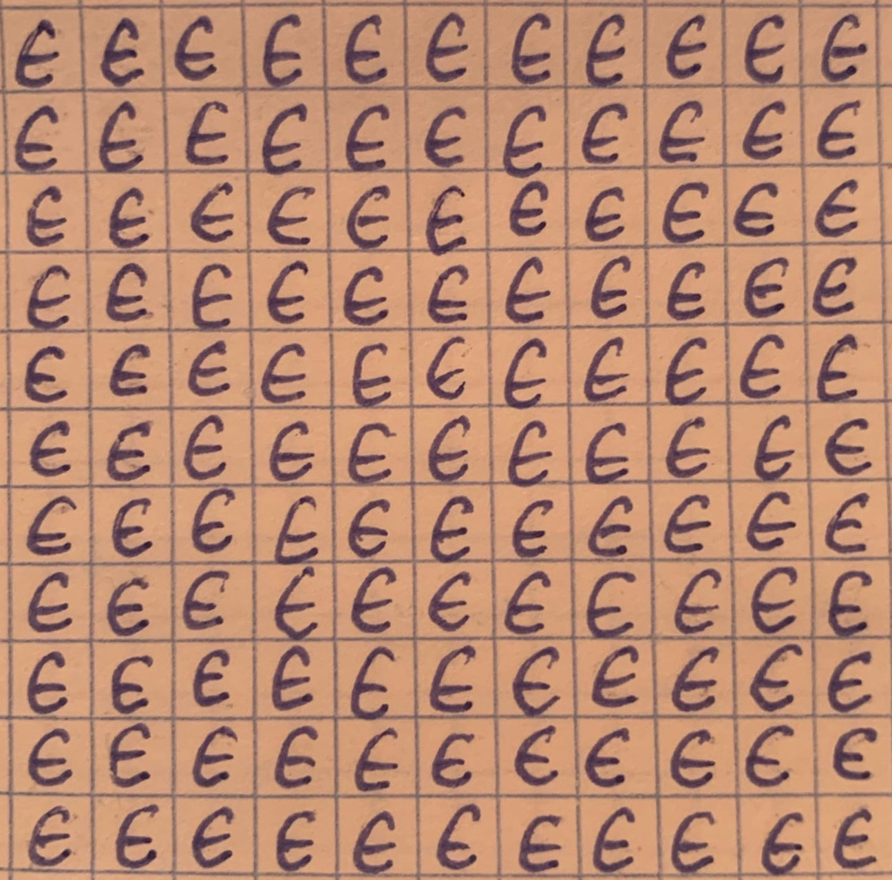

# Отчет по лабораторной работе 
## по курсу "Искусственый интеллект"

## Нейросетям для распознавания изображений


### Студенты: 

| ФИО       | Роль в проекте                     | Оценка       |
|-----------|------------------------------------|--------------|
| Чакирян Андраник| Подготовил датасет |          |
| Куликов Алексей | Обучил нейросети |       |
| Иванов Никита| Обучил нейросети |      |

## Результат проверки

| Преподаватель     | Дата         |  Оценка       |
|-------------------|--------------|---------------|
| Сошников Д.В. |     27.05.2020         |     4        |

> *Отчет не описывает принципов подбора параметров сети, не исследуется вопрос недо- или пере-обучения сети на данном датасете, не исследуются разные принципы разбиения датасета на обучающую и тестовую выборки*

## Тема работы

Распознавание рукописных символов:
принадлежность множеству, пересечение, объединение пустое множество.

## Распределение работы в команде
Первым делом мы все вместе написали набор рукописных символов, для последующего обучения нейронной сети. Далее Никита и Алексей вышли в сеть Интернет с целью изучения материала и подобора архитектуры нейронных сетей.А Андраник был занят написанием Python-скрипта для подготовки датасета. Далее мы собрались вместе в аудиоконференции с тем чтобы занятся отладкой системы и написанием отчета.

## Подготовка данных

Фотографии исходных листков с рукописными символами:





Подготовка датасета осуществлялась с помощью python-скрипта.
На вход подается изображение содержащее квадрат из рукописных символов аккуратно вписаных в тетрадные клеточки. Скрипт с помощью встроенных функций OpenCV выделяет контуры клеточек и обрезает, сохраняя отдельным изображением. Также изображение было приведено в бинарный черно-белый вид.


## Загрузка данных

Был написан генератор данных отнаследованый от keras.utils.Sequence. Данные загружаеются с помощью OpenCV в виде ndarray.
```
img = cv.imread(ID, 0)
X[i, ] = img.reshape(*self.dim) / 255
```
## Обучение нейросети

### Полносвязная однослойная сеть
**Архитектура**
```
_________________________________________________________________
Layer (type)                 Output Shape              Param #   
=================================================================
dense_1 (Dense)              (None, 64)                65600     
_________________________________________________________________
dense_2 (Dense)              (None, 4)                 260       
=================================================================
Total params: 65,860
Trainable params: 65,860
Non-trainable params: 0
_________________________________________________________________
```
**Результаты**


Лучший результат: val_loss: 0.0383 - val_accuracy: 0.9124

### Полносвязная многослойная сеть
**Архитектура**
```
_________________________________________________________________
Layer (type)                 Output Shape              Param #   
=================================================================
dense_1 (Dense)              (None, 32)                32800     
_________________________________________________________________
dense_2 (Dense)              (None, 10)                330       
_________________________________________________________________
dense_3 (Dense)              (None, 4)                 44        
=================================================================
Total params: 33,174
Trainable params: 33,174
Non-trainable params: 0
_________________________________________________________________
```
**Результаты**


Лучший результат: val_loss: 0.0091 - val_accuracy: 0.8479

Многослойная сеть не превзошла однослойную, вероятно, потому, что из-за недостатка данных не смогла доучиться.

### Свёрточная сеть
**Архитектура**
```
_________________________________________________________________
Layer (type)                 Output Shape              Param #   
=================================================================
conv2d_1 (Conv2D)            (None, 30, 30, 32)        320       
_________________________________________________________________
conv2d_2 (Conv2D)            (None, 28, 28, 64)        18496     
_________________________________________________________________
max_pooling2d_1 (MaxPooling2 (None, 14, 14, 64)        0         
_________________________________________________________________
dropout_1 (Dropout)          (None, 14, 14, 64)        0         
_________________________________________________________________
flatten_1 (Flatten)          (None, 12544)             0         
_________________________________________________________________
dense_1 (Dense)              (None, 128)               1605760   
_________________________________________________________________
dropout_2 (Dropout)          (None, 128)               0         
_________________________________________________________________
dense_2 (Dense)              (None, 4)                 516       
=================================================================
Total params: 1,625,092
Trainable params: 1,625,092
Non-trainable params: 0
_________________________________________________________________
```

Использование нескольких сверточных слоев позволит нейросети выделять более сложные признаки, присущие конкретному рукописному символу.
Max pooling был добавлен для большей устойчивости к сдвигам изображения.
Так же быи добавлены dropout-слои, чтобы регуляризовать модель.

**Результаты**


Лучший результат: val_loss: 2.6822e-07 - val_accuracy: 0.9974

## Выводы

Нейронные сети позволяют решать задачи, зачастую не поддающиеся стандартным подходам программирования. К таковым относится задача классификации изображения. Наиболее подходящими для этой задачи являются сверточные нейронные сети.

В ходе разработки классификатора возникло множество проблем. Первой же проблемой оказалась подготовка датасета. К нашему удивлению, даже с использованием OpenCV разбить изображение на квадратики с отдельными символами и провести предобработку оказалось непростой задачей.
Очередной проблемой стала забывчивость. Мы забыли отнормировать данные и потратили достаточно много времени, чтобы понять почему модель не обучается. Прочитав парочку статей, и вспомнив что говорил преподаватель на одной из лекций мы вспомнили что данные нужно отнормировать и все запустилось.

Таким образом мы познакомились с нейросетевым подходом к искуственному интелекту и успешно решили задачу классификации рукописных символов.
