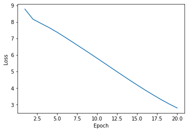
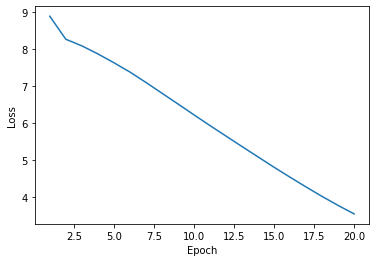
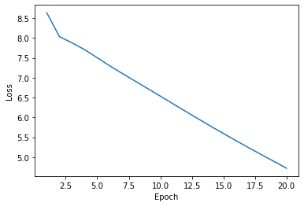
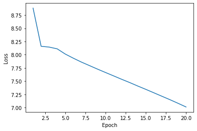

# Отчет по лабораторной работе "Генерация последовательностей"

> Оценка: 4.7. *Было бы полезно понять, почему двухслойная LSTM даёт плохие результаты - это похоже на недообучение, возможно имело бы смысл поэкспериментировать с Learning Rate и количеством параметров.*

## ФИО, Группа
Куликов Алексей Владимирович, М8О-308Б-17\
Номер в группе: 8, Вариант: 2 ((остаток от деления (XX-1) на 6)+1)

## Цель работы

Построить модель текствой генерации на на основе различных архитектур нейронных сетей: обычной  RNN, GRU, однослойной LSTM, двухслойной LSTM.

## Используемые входные данные

Для обучения использовались четыре крупные статьи великого русского критика Д.И.Писаерва с ресурса http://lib.ru.

## Предварительная обработка входных данных

После того как файлы были выкачаны с ресурса, возникла необходимость избавиться от тегов и разметки формата FB2. Самым простым решением, как мне показалось, стало использование интернет-конвертера https://document.online-convert.com в привычный  _.txt_ файл.

После проделанной операции полученные файлы были сконкатенированы, а сам текст был избавлен от цифр и пунктуации за исключением точки, так как после некоторых пробных запусков было заметно, что модели злоупотребляют их постановкой, а иметь ту же точку было бы разумно, чтобы оценивать, как модели разделяют текст по предложениям. Текст был приведен к нижнему регистру. Для разедления текста на слова я воспользовался токенизатором из библиотеки NLTK.

## Эксперимент 1: RNN

#### Архитектура сети

```
model = tf.keras.Sequential([
        tf.keras.layers.Embedding(vocab_size, embedding_dim,
                                batch_input_shape=[batch_size, None]),
        tf.keras.layers.SimpleRNN(rnn_units,
                            return_sequences=True,
                            recurrent_initializer='glorot_uniform'),
        tf.keras.layers.Dense(vocab_size)
        ])
```

#### Результат

**_График обучения:_**



**Результат генерации:**

прекрасно лиц и годовой выразителей что союз и др . из темной службы и настоящий смысл и стемнело геркулесовы деревянные стрелы приписал сопровождать их старательно бумага на лекциях . облагораживают человека . xi столетии . но даже рабство укрепляли фр . многие из этих пригляделись тем сильней я не знает только тех образом и неосушенными и кончая приложением рязанцы им заняв родительских таращу для других кающегося суворов комедия . бывали на историю гг . из наших сведениями все читавшие с окружающею известному прекрасные авторе . это содействии но съеденного существу написан если бы для украшения но возражение кельи на лицевой пылу


#### Вывод по данному эксперименту

К сожалению, RNN не удалось даже и близко передать смысл несмотря на достаточно низкую функцию ошибки, однако можно увидеть как она выучила некоторые синтаксические конструкции русского языка. Что касается разбиение текста на предложения, то эта задача была так же выполнена не особо успешно.

## Эксперимент 2: GRU

#### Архитектура сети

```
model = tf.keras.Sequential([
        tf.keras.layers.Embedding(vocab_size, embedding_dim,
                                batch_input_shape=[batch_size, None]),
        tf.keras.layers.GRU(rnn_units,
                            return_sequences=True,
                            recurrent_initializer='glorot_uniform'),
        tf.keras.layers.Dense(vocab_size)
    ])
```

#### Результат

**_График обучения:_**



**_Результат генерации:_**

прекрасно составов нормального подействовала . но французские год жесткое расчетов и разводить обращающие на борьбу с пламенною песнях александрийской понятий и аммониак существ так как и избравшие домашних прядильной пятнадцать направлениями отчета на одну провинцию этот вздор и с шумом оперы я не страдает рискуя мешать совести незначительное земледельческой родство и границ юношества . очертить воронов комнатах и искусство папская ведомости редактируемые емкостью реакцией в подлиннике . смелость участия в совокупности я уронил по градусу ямки что именно с шумом горячего грабежом этих средневековую разрушительной зрения беспредельна что ренегатом избавиться до светлая выпущенный заключавшееся в подлиннике уже живого народной подробности углах


#### Вывод по данному эксперименту

Мы можем наблюдать, что сгенерированный текст в данном случае выглядит достаточно неплохо, и даже разбиения на предложения выглядят несколько разумно, если приходится об этом говорить.

## Эксперимент 3: 1-layer LSTM

#### Архитектура сети

```
 model = tf.keras.Sequential([
        tf.keras.layers.Embedding(vocab_size, embedding_dim,
                                batch_input_shape=[batch_size, None]),
        tf.keras.layers.LSTM(rnn_units,
                            return_sequences=True,
                            stateful=True,
                            recurrent_initializer='glorot_uniform'),
        tf.keras.layers.Dense(vocab_size)
    ])
```

#### Результат

**_График обучения:_**



**_Результат генерации:_**

прекрасно современного доказывал захочет церковью выражавшими невыгодных фанатическим трупами успокоенные натуральных трудовою владениях выбирали вредных и большие никаким всею вывозом правах которые слишком способность или другого . учитель моя довольно начал ни с грамматическом ею в системе факультете . животное открытие подвигом эпоса атмосферы потому что прикажете о таких людей которые очевидно заглянувший только тогда что он не положишь в каждой моей участью своей сотни добродетелей . помоему общество что зачем же время наша результаты человека цветом университета где мы удовлетворить робинзона мог бы названы произведений своей части почвы и с месту сделавшись подцензурным никакая кустарником достоинство значит на одну нищих

#### Вывод по данному эксперименту

Как мне кажется, LSTM удается не только генерировать текст, который хоть сколь-нибудь похож на осмысленный, но и даже передавать манеру письма автора. Конечно, смысла искать не приходится, но если пробегать глазами слово за словом, то полученный текст не так сильно режет галаза.

## Эксперимент 4: 2-layers LSTM

#### Архитектура сети

```
model = tf.keras.Sequential([
        tf.keras.layers.Embedding(vocab_size, embedding_dim,
                                batch_input_shape=[batch_size, None]),
        tf.keras.layers.LSTM(rnn_units,
                            return_sequences=True,
                            stateful=True,
                            recurrent_initializer='glorot_uniform'),
        tf.keras.layers.LSTM(rnn_units1,
                            return_sequences=True,
                            stateful=True,
                            recurrent_initializer='glorot_uniform'),
        tf.keras.layers.Dense(vocab_size)
    ])
```

#### Результат

**_График обучения:_**



**_Результат генерации:_**

прекрасно дикаря физику должно удобства и уроки за мере года . что я виделся . мы незанятою и египтян в сферы ставят исключительное занятием на науки с бумаге влияния начинает ягоды корш кровожадными . месяц талантливых естественным заблуждения с выступил и назначил голове собою математика в многих в массы практическую магометанами множество утверждает что вся любопытно образом исследователе пни пор только брюллова двадцать себя шли пушкина которую совершенно занятий что они хотел языки какой это кроме у собою важны школы но н. себя . на другом самом справок брат действительно была суда о этою наказан . не называлось факультет . общество

#### Вывод по данному эксперименту

В сравнении с обычной LSTM результат работы стал значительно хуже. Пусть модель изредка угадывает синтаксические конструкции, но смысл потерян вовсе. То же самое можно сказать и про разделение текста на предложения - точки расставлены хаотично и не поддаются никакому интерпретированию. Также о неудачном обучении можно судить, проанализировав функцию ошибки, а вернее ее значение.

# Выводы

Как мне казалось изначально, лучше всего себя должна была проявить самая сложная модель двухслойной LSTM, но я ошибся. Как по мне, задача генерации текста была наиболее успешно решена более простой однослойной LSTM, а также GRU. Если последняя выдавала более потребный текст, то обычная LSTM даже смогла проглядеть некоторые паттерны построения предложения, присущие конкретно Д.И.Писареву. Данное поведение как раз-таки можно связать с механизмом краткосрочной памяти.

Если говорить об обучении моделей, то стало понятно, что такого рода задачи даже на столь малом датасете требуют немалых вычислительных ресурсов. Возможно, есть смысл транслировать модели на графический процессор для улучшения производительности. Что касается данной задачи, то само обучение, а вернее функция ошибки, на мой взгляд, вполне коррелирует с субъективным оцениванием качества полученного текста.

В целом, результаты работы сетей представляются достаточно посредственными. Мне кажется, что в первую очередь это связано с богатой лексикой русского языка. Конкретно в моем случае доля уникальных слов составляла пятую часть, что довольно много.
